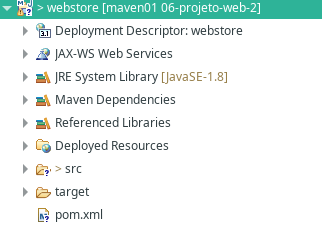
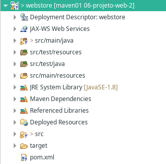
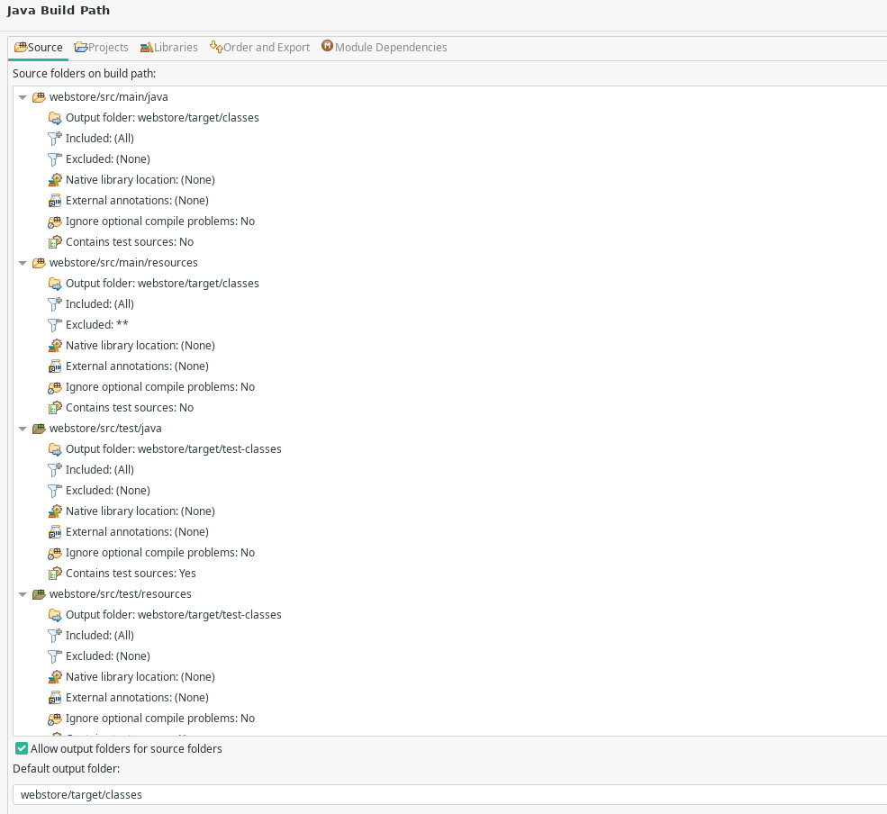
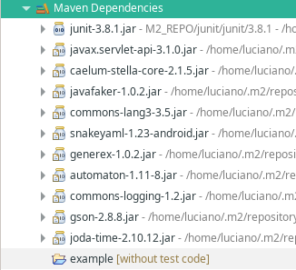
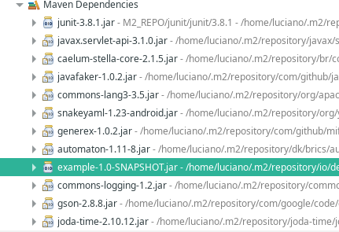
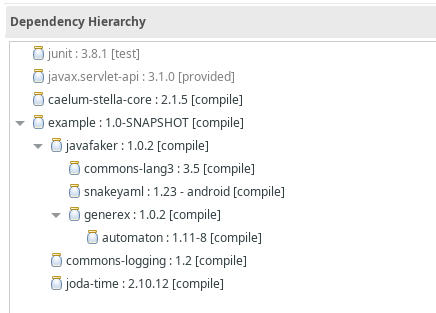

# 06. Projeto Web (Continuação)

## Importando o projeto no Eclipse

- **Definindo a versão do Java**:

Ao importar o projeto maven no Eclipse, alguns erros de JDK podem ser exibidos.

Para evitá-los e ser mais explícito sobre qual versão utilizar, adicione essa property no `pom.xml`.

```
    <properties>
        <maven.compiler.target>1.8</maven.compiler.target>
        <maven.compiler.source>1.8</maven.compiler.source>
    </properties>
```

- **Configurando os sources**:

Dependendo do projeto importado, os sources podem não estar configurados.



Nesse caso, é possível e recomendado configurá-los seguindo o padrão utilizado em projetos Maven.



Para isso, acesse no package explorer, as propriedades do projeto:

```
Build Path > Configure Build Path 
```



## Exportando para `.war`

Para compartilharmos esse projeto web ou fazemos o deploy em alguns servidor, o mais utilizado é exportar o projeto para um arquivo format `.war`.

Esse formato, basicamente é a compactação de todos os arquivos do projeto em um `.zip`, porém com a extensão `war`.

No Eclipse, acesse no package explorer as propriedades do projeto:

```
Export > War File
```

O arquivo será gerado na pasta `target/`.

```
$ unzip -l webstore.war 
Archive:  webstore.war
  Length      Date    Time    Name
---------  ---------- -----   ----
        0  2021-10-03 14:36   META-INF/
      130  2021-10-03 14:36   META-INF/MANIFEST.MF
        0  2021-10-03 14:36   WEB-INF/
        0  2021-10-03 14:36   WEB-INF/classes/
        0  2021-10-03 14:36   WEB-INF/classes/io/
        0  2021-10-03 14:36   WEB-INF/classes/io/dev/
        0  2021-10-03 14:36   WEB-INF/classes/io/dev/servlets/
        0  2021-10-03 14:36   WEB-INF/lib/
      642  2021-10-02 18:22   index.jsp
     1081  2021-10-03 14:36   WEB-INF/classes/io/dev/servlets/MensagemServlet.class
      255  2021-10-02 18:56   WEB-INF/web.xml
   176285  2021-10-01 17:00   WEB-INF/lib/automaton-1.11-8.jar
  1295981  2021-10-01 17:00   WEB-INF/lib/javafaker-1.0.2.jar
   296616  2021-10-01 17:00   WEB-INF/lib/snakeyaml-1.23-android.jar
    14395  2021-10-01 17:00   WEB-INF/lib/generex-1.0.2.jar
   479881  2021-10-01 17:00   WEB-INF/lib/commons-lang3-3.5.jar
   138416  2021-10-03 14:22   WEB-INF/lib/caelum-stella-core-2.1.5.jar
        0  2021-10-03 14:36   META-INF/maven/
        0  2021-10-03 14:36   META-INF/maven/io.dev.app.webstore/
        0  2021-10-03 14:36   META-INF/maven/io.dev.app.webstore/webstore/
     1610  2021-10-03 14:36   META-INF/maven/io.dev.app.webstore/webstore/pom.xml
      119  2021-10-03 14:36   META-INF/maven/io.dev.app.webstore/webstore/pom.properties
---------                     -------
  2405411                     22 files
```

Veja que o pacote contém todos os arquivos do projeto, inclusive as dependências. Isso porque no `pom.xml` quando adicionada uma dependência, por padrão seu escopo será definido _compile_.

> Esse escopo faz com que a dependência esteja disponível para compilação para quem depender dela. Por exemplo, se iremos realizar um deploy no servidor de aplicação, precisaremos das dependências do projeto, e graças ao compile elas estarão disponíveis para compilação em tempo de execução.

Lembrando que o _junit_ não foi adicionado ao pacote, pois seu escopo estava definido como _test_.

```
...
<groupId>junit</groupId>
<artifactId>junit</artifactId>
...
<scope>test</scope>
...
```

### Outros escopos

- Provided
- Runtime
- Test
- System
- Import

## Adicionando projetos como dependências

Podemos adicionar nossos próprios projetos como dependência no xml. Para isso, basta utilizar as configurações definidas no xml do projeto.

No exemplo abaixo, vamos adicionar o projeto `example`, já existente.

```
<dependency>
    <groupId>io.dev.app</groupId>
    <artifactId>example</artifactId>
    <version>1.0-SNAPSHOT</version>
</dependency>
```

A partir daí, o projeto já é exibido no project explorer, como dependência, para o WebStore.



Desta forma, já podemos utilizar o projeto `example` no código do projeto `webstore`. Porém, nesse ponto, ainda não podemos criar o pacote da aplicação web.

Por enquanto, o projeto web ainda está utilizando como dependência o projeto da aplicação `example`. Para utilizarmos `example` como dependência e exportar o arquivo .war, precisar instalar o .jar do projeto example no repositório local do Maven.

Desta forma, no projeto exemplo, geramos o jar com o comando:

```
$ mvn package install
```

O jar será instalado no repositório local:

```
[INFO] Installing .../example/target/example-1.0-SNAPSHOT.jar to ~/.m2/repository/io/dev/app/example/1.0-SNAPSHOT/example-1.0-SNAPSHOT.jar
[INFO] Installing .../example/pom.xml to ~/.m2/repository/io/dev/app/example/1.0-SNAPSHOT/example-1.0-SNAPSHOT.pom
[INFO] Installing .../example/target/example-1.0-SNAPSHOT-jar-with-dependencies.jar to ~/.m2/repository/io/dev/app/example/1.0-SNAPSHOT/example-1.0-SNAPSHOT-jar-with-dependencies.jar

```
Agora podemos adicionar o .jar como dependência no projeto web. Para isso, remova o projeto example do Eclipse (ou apenas feche-o) e atualize o pom.xml.

Olhando nas dependência do Maven, verá que o `example-1.0-SNAPSHOT.jar` foi adicionado.



### Verificando o repositório local

Verificando o log de instalação da dependência example, vemos que o jar foi instalado em `~/.m2/repository`. Vamos listar o jar existente lá:

```
unzip -l example-1.0-SNAPSHOT.jar 
Archive:  example-1.0-SNAPSHOT.jar
  Length      Date    Time    Name
---------  ---------- -----   ----
        0  2021-10-03 15:59   META-INF/
      133  2021-10-03 15:59   META-INF/MANIFEST.MF
        0  2021-10-03 15:59   io/
        0  2021-10-03 15:59   io/dev/
        0  2021-10-03 15:59   io/dev/app/
        0  2021-10-03 15:59   io/dev/model/
      601  2021-10-03 15:59   io/dev/app/App.class
     2141  2021-10-03 15:59   io/dev/model/Pessoa.class
        0  2021-10-03 15:59   META-INF/maven/
        0  2021-10-03 15:59   META-INF/maven/io.dev.app/
        0  2021-10-03 15:59   META-INF/maven/io.dev.app/example/
     3546  2021-10-03 15:55   META-INF/maven/io.dev.app/example/pom.xml
      109  2021-10-03 15:59   META-INF/maven/io.dev.app/example/pom.properties
---------                     -------
     6530                     13 files
```

Perceba que a dependência `com.github.javafaker`, utilizada no projeto example não aparece na lista de arquivos. 

Porém quando subimos o servidor Jetty, a aplicação web funciona normalmente. Isso se deve ao fato de que a dependência do `javafaker` existe no pom.xml de example e desta forma, ela é adicionada na árvore no projeto final, como dependência de example.



É possível também visualizar a árvore de dependências utilizando o cli do Maven com o comando { }

```
[INFO] io.dev.app.webstore:webstore:war:1.0-SNAPSHOT
[INFO] +- junit:junit:jar:3.8.1:test
[INFO] +- javax.servlet:javax.servlet-api:jar:3.1.0:provided
[INFO] +- br.com.caelum.stella:caelum-stella-core:jar:2.1.5:compile
[INFO] \- io.dev.app:example:jar:1.0-SNAPSHOT:compile
[INFO]    +- com.github.javafaker:javafaker:jar:1.0.2:compile
[INFO]    |  +- org.apache.commons:commons-lang3:jar:3.5:compile
[INFO]    |  +- org.yaml:snakeyaml:jar:android:1.23:compile
[INFO]    |  \- com.github.mifmif:generex:jar:1.0.2:compile
[INFO]    |     \- dk.brics.automaton:automaton:jar:1.11-8:compile
[INFO]    +- commons-logging:commons-logging:jar:1.2:compile
[INFO]    \- joda-time:joda-time:jar:2.10.12:compile
```