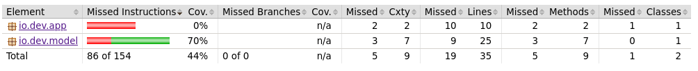
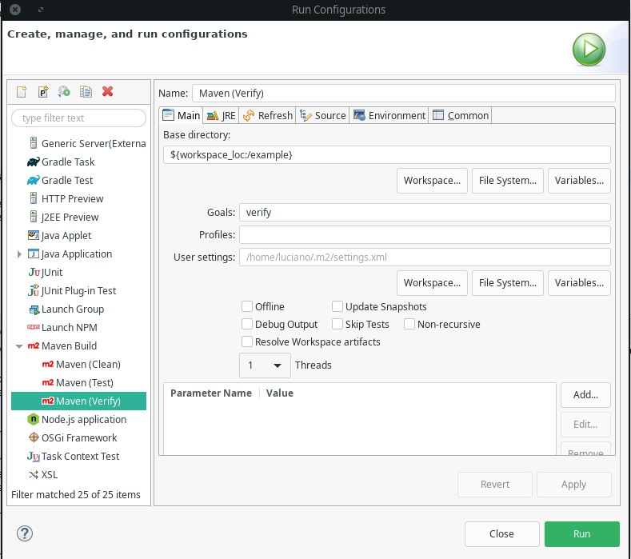

# 04. Relatórios de qualidade

## Fases 

Existem várias fases que podem ser executadas em um build de um projeto. [São elas](https://maven.apache.org/guides/getting-started/maven-in-five-minutes.html#running-maven-tools): 

```
validate
compile
test
package
integration-test
verify
install
deploy
```

Por padrão, quando executada um fase, se existir anterior, será obrigatoriamente executada. Por exemplo, caso execute o compile, o validate será sempre executado antes.

## Plugins

Plugins podem ser adicionados ao maven, incrementando suas funcionalidades e adicionando novos recursos. Por exemplo o plugin [PMD](https://maven.apache.org/plugins/maven-pmd-plugin/).

### Goals 

- **pmd:pmd**: realiza uma análise no código e gera um relatório/site com os resultados.

```
mvn pmd:pmd
```

```
...
Rule                Violação                                        Linha
UnusedPrivateField  Avoid unused private fields such as 'idade'.    11
...
```

- **pmd:check**: falha o build se alguma violação for encontrada no código.

#### Definindo execução automática

Um goal pode ser executado automaticamente em uma determinada fase do build. Para isso, adicione sua config no `pom.xml`.

```
  <build>
    <plugins>
      <plugin> <!-- Define o plugin -->
        <groupId>org.apache.maven.plugins</groupId>
        <artifactId>maven-pmd-plugin</artifactId>
        <version>3.10.0</version>
        <executions>
            <execution><!-- Define a fase de execução do plugin -->
                <phase>verify</phase>
                    <goals>
                        <goal>check</goal> <!-- Define o goal executado -->
                    </goals>
            </execution>
        </executions>
      </plugin>
    </plugins>
  </build>
```

### Utilizando o plugin JaCoCo

[Esse plugin](https://www.eclemma.org/jacoco/trunk/doc/maven.html) gera um relatório da cobertura dos testes no projeto.

#### Configurando o `pom.xml`

- **Plugin**: adicione o xml do plugin

```
<plugin>
  <groupId>org.jacoco</groupId>
  <artifactId>jacoco-maven-plugin</artifactId>
  <version>0.8.7</version>
</plugin> 
```

- **Build**: configurando goals no build ou em alguma fase do processo.

Esse plugin define os seguintes goals:

```
help
prepare-agent
prepare-agent-integration
merge
report
report-integration
report-aggregate
check
dump
instrument
restore-instrumented-classes
```

Defina um goal, utilizando o xml:

```
          <executions>
            <execution>
              <goals>
                <goal>prepare-agent</goal>
                <goal>report</goal>
              </goals>
            </execution>
          </executions>
```

Para o plugin gerar a cobertura, são necessárias duas fases: prepare-agent e report.

Desta forma, escrevemos um método e rodamos o comando `mvn verify`.

No primeiro momento, configuramos o teste para falhar, entrar a mensagem exibida no console é algo como:

```
[ERROR] There are test failures.
```

Após correção, rodamos novamente o `verify`:

```
-------------------------------------------------------
 T E S T S
-------------------------------------------------------
...
Tests run: 1, Failures: 0, Errors: 0, Skipped: 0, Time elapsed: 0.257 sec

Results :

Tests run: 1, Failures: 0, Errors: 0, Skipped: 0
```

Verificamos que os testes passaram e além disso, no diretório `target/site/jacoco/` foi criado um relatório exibindo as estatísticas dos testes realizados.



#### Utilizando o Eclipse

Já temos o projeto importado no Eclipse, mas com algumas alterações no cli, pode ser necessário executar um update para que aplique todas as alterações também no ambiente da IDE.

Após corrigidos eventuais falhas, é só criar os perfis de configuração do Maven no Run do Eclipse. Abaixo um exemplo de como configurar para executar um `verify` no Eclipse.



### Atualizando dependências

- Verificar:

```
mvn versions:display-dependency-updates
```

Como todas as dependências estão _pinadas_, no caso do projeto de exemplo, foi exibido: 

```
[INFO] The following dependencies in Dependencies have newer versions:
[INFO]   com.google.code.gson:gson ............................. 2.8.0 -> 2.8.8
[INFO]   joda-time:joda-time ................................. 2.9.9 -> 2.10.12
[INFO]   junit:junit ........................................... 4.11 -> 4.13.2
```

- Verificar e Aplicar

```
mvn versions:use-latest-versions
```

```
[INFO] Major version changes allowed
[INFO] Updated junit:junit:jar:4.11 to version 4.13.2
[INFO] Updated com.google.code.gson:gson:jar:2.8.0 to version 2.8.8
[INFO] Updated joda-time:joda-time:jar:2.9.9 to version 2.10.12
```

Para verificar se tudo continua funcionando, rodamos `mvn test`:

```
[INFO] ------------------------------------------------------------------------
[INFO] BUILD SUCCESS
[INFO] ------------------------------------------------------------------------
```